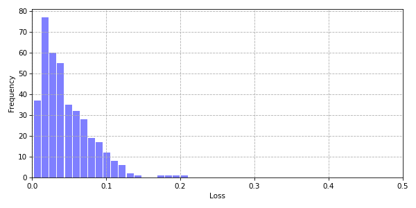

# Anomaly Detection for Bearing Failures

## Introduction

Bearings used in industry have unusual vibrations as a preliminary sign of failures, which implies that a mechanical degradation is potentially in progress. If such abnormal vibration can be detected, the bearing can be replaced before the actual failure occurs and the equipment downtime due to failure can be kept relatively short. Here, in order to predict future bearing failures before they occur, we use an *autoencoder*, a form of neural network, to build a model that identifies abnormal vibrations from continuous sensor readings for a set of bearings.

## Dataset and Preprocessing

As input bearing vibration sensor readings, we use datasets enrolled in *NASA Acoustics and Vibration Database*. In these datasets, bearing vibrations are recorded in each file as 1 second signals per reading, and each dataset consists of a set of 1-second bearing vibrations measured continuously at 10 minute intervals. The number of files in a dataset is unspecified, as readings continue until bearing failure. Since the sampling rate of the vibration sensor is 20 kHz, each file contains 20,480 data points.

We aggregate 1 second signals every 10 minutes corresponding to each file into a single data point by mean and absolute value. The aggregated data points are combined into a single `Pandas` dataframe, which is used as the dataset for the analysis.

### Define Training and Test Split

Before training a model, the dataset is split into two parts: a training set that does not include abnormal vibrations and a test set that includes the period from abnormal vibration to failure. Here, simply assuming from the time frame, the first 40% of the dataset, which is considered to represent normal operating conditions, is used as the training set, and the remaining 60% of the dataset after that, up to bearing failure, is used as the test set. Figure 1 shows a plot along the time axis of the aggregated readings from the vibration sensors of a set of four bearings.

**Figure 1. The aggregated readings from the sensors of the vibration of a set of four bearings. The dashed line in the figure shows the point where the training and test sets were split. We can see from the figure that the period of abnormal vibrations is not included in the training set.**

### LSTM Autoencoder

The autoencoder model is implmented using modules of *Long Short-Term Memory*, LSTM, a form of *recurrent neural network*, RNN in `PyTorch` framework with `Keras/TensorFlow` implementation as a reference[^Larzalere].

The autoencoder consists of two parts, an encoder and a decoder, which encode the input into the embedding dimension and then output by the decoder to reconstructed the input from the embedding dimension. The model performs unsupervised learning to reduce the loss between the input and the output. The encoder and decoder are composed of a two-layer LSTM, with the hidden dimension set to 16 and the embedding dimension set to 4. The *mean absolute error*, MAE is used as the loss function.

## Determine a Threshold from the Loss Distribution

It is important to determine the optimal threshold to detect anomalies in order to avoid detecting many *false positives* under normal operating conditions. First, we performed unsupervised learning using the LSTM autoencoder to reconstruct the training set. Using the trained model, losses were computed for the training set. The distribution of losses is shown in Figure 2.

**Figure 2. The loss distribution calculated for the training set using the trained model. The dashed line indicates the threshold value.**

This plot is used as a reference to determine a suitable threshold for identifying anomalies. The threshold should be set larger than the noise level so that the abnormal vibration and the background vibration noise can be statistically significantly discriminated. If the vibration noise exceeds the threshold, it is a false positive, and if the threshold is set lower than appropriate value, it leads to increased costs due to unnecessary bearing replacements, etc. Based on the loss distribution on the training set, we decided to use 0.275 as the threshold for detecting anomalies.

## Anomaly Detection

Next, the losses were calculated for the test set using the trained model to check if the output exceeds the threshold identified as abnormal. The transition of losses against the test set is shown in Figure 3.

**Figure 3. The transition of losses against the test set. The dashed line inddicates the threshold value.**

The figure showing the loss distribution for this model visualizes the occurrence of abnormal vibration, which is a predictor of bearing failures. We can confirm that the losses between input and output actually exceed the defined threshold before bearing failure occurs.

[^Larzalere]: B. Larzalere, *LSTM Autoencoder for Anomaly Detection*, https://github.com/BLarzalere/LSTM-Autoencoder-for-Anomaly-Detection.
